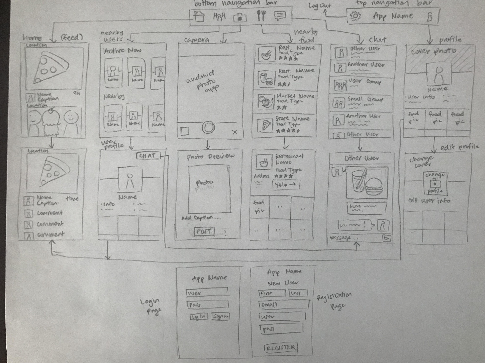

# Eating Companion Finder

## Table of Contents
1. [Overview](#Overview)
1. [Product Spec](#Product-Spec)
1. [Wireframes](#Wireframes)
2. [Schema](#Schema)

## Overview
### Description
This mobile app lets users find people near them to grab a bite with. Users can set up profiles, message each other, and view nearby restaurants.

### App Evaluation
- **Category:** Social, Food
- **Mobile:** Mainly/mostly mobile, for people on the go
- **Story:** Don't need to feel lonely at meals, and you can meet people in a casual/open environment. You can choose who to connect with based on profiles.
- **Market:** Anyone who wants to meet new people or have someone to eat with. Can be used for networking or casual meetups.
- **Habit:** Users might get used to having someone else to eat with and feel excited to meet new people. There could also be deals featured on the app to incentivize users to eat at certain restaurants with others
- **Scope:** Can start out as an app with basic profiles, restaurants nearby, and messaging and then later expand to have deals and try to match/recommend people based on interests

## Product Spec

### 1. User Stories (Required and Optional)

**Required Must-have Stories**

* User can create a new account
* User can login
* User can set up a profile (photos, bio)
* User can see users near them
* User can message other users
* User can see nearby restaurants
* User can see other profiles

**Optional Nice-to-have Stories**

* User can see restaurant deals
* User can see recommended users based on common interests
* User can post photos of food/have a food feed
* User can comment on other food posts
* User can receive notifications for messages/deals
* User can add friends to see their posts in their feed
* User can see restaurant food in their feed

### 2. Screen Archetypes

* Login screen
    * User can login
* Registration Screen
    * User can create a new account
* Nearby Restaurants Screen
    * User can see nearby restaurants
    * User can create a new group chat
* Restaurant Detail Screen
    * User can see more details about a restaurant (rating, address, etc.)
* Chat Screen
    * User can see other group chats near them or set one up
* Chat Room Screen
    * User can message other users for a specific restaurant and time to meet
* Profile Screen
    * User can set up a profile (photos, bio)
* Other User Profile Screen
    * User can see other profiles (photos, bio)
    * User can message this user
* Camera Screen
    * User can take pictures
    * User can upload pictures

### 3. Navigation

**Tab Navigation** (Tab to Screen)

* Restaurants Nearby
* Messages
* User Profile
* (Stretch) Users Nearby

**Flow Navigation** (Screen to Screen)

* Login screen
   => Registration screen
   => Chat screen
* Registration screen
   => Chat screen
* Chat screen
   => Nearby Restaurants screen
   => Chat room/detail screen
   => Profile screen
* Nearby Restaurants screen
  => Detailed restaurant screen
  => Chat screen
* Self Profile Screen
  => Edit profile screen
  => Camera screen
* Other User Profile screen
  => Message screen
* Camera screen
  => Self Profile screen

## Wireframes
[Add picture of your hand sketched wireframes in this section]


### [BONUS] Digital Wireframes & Mockups

(Work in progress) https://www.figma.com/file/h1cTCJ0Bk4bR0vQOLJ1JLv/Eating-Companion-App?node-id=0%3A1

### [BONUS] Interactive Prototype

## Schema 
### Models
#### User

   | Property       | Type     | Description |
   | -------------- | -------- | ------------|
   | userId         | String   | unique id for the user (default field) |
   | username       | String   | user's screenname/display name |
   | password       | String   | user's password for login |
   | profilePicture | File     | user's profile image |
   | bio            | String   | user's description |
   | city           | String   | user's default city |
   | state          | String   | user's default state |
#### Message

   | Property       | Type     | Description |
   | -------------- | -------- | ------------|
   | userId         | Pointer  | unique id for the user (default field) |
   | body           | String   | message's text content |
   | createdAt      | DateTime | time the message was posted |
   | media          | File     | (optional) media file posted |
   | chatId         | Pointer  | unique chat id for that restaurant + time |
#### Chat

   | Property       | Type     | Description |
   | -------------- | -------- | ------------|
   | chatId         | String   | unique chat id (default field) |
   | restaurantId   | String   | unique restaurant id (from Google Maps API) |
   | timeToGo       | DateTime | time the meetup is set for |
   | city           | String   | city where the restaurant is |
   | state          | String   | state where the restaurant is |
### Networking
#### List of network requests by screen
   - Login Screen
      - (Create/POST) Authorize user credentials for login
   - Registration Screen
      - (Create/POST) Create a new user object
   - Profile Screen
      - (Read/GET) Query logged in user object
      - (Update/PUT) Update user profile image
      - (Update/PUT) Update user bio
      - (Delete) Logout/remove user session
   - Restaurant List Screen
      - (Read/GET) Retrieve list of nearby restaurants (from Google Maps API)
      - (Create/POST) Create a new chat object
   - Restaurant Details Screen
      - (Read/GET) Retrieve details of selected restaurant (from Google Maps API)
   - Chat List Screen
      - (Read/GET) Query active chats in user's city and chats the user is part of
      ```java
         ParseQuery<Chat> query = ParseQuery.getQuery(Chat.class);
         query.include(Chat.KEY_USER);
         query.whereEqualTo(Chat.KEY_USER, ParseUser.getCurrentUser());
         query.setLimit(20);
         query.addDescendingOrder(Chat.KEY_TIME_TO_GO);
         query.findInBackground(new FindCallback<Chat>() {
             @Override
             public void done(List<Chat> chats, ParseException e) {
                 if (e != null) {
                     Log.e(TAG, "Issue with getting chat rooms", e);
                     return;
                 } else {
                     Log.i(TAG, "Successfully retrieved chat rooms");
                     // do something with queried chat rooms
                 }
             }
         });
         ```
   - Chat Detail Screen
      - (Create/POST) Create a new message object
#### Existing API endpoints
##### Google Maps Places API
- Base URL: [https://maps.googleapis.com/maps/api/place](https://maps.googleapis.com/maps/api/place/textsearch/json)
   
   HTTP Verb | Endpoint | Description
   ----------|----------|------------
    `GET`    | /textsearch/json?query=restaurants+city+state | get all restaurants in specific city
    `GET`    | /details/json?placeid=[restaurant id] | get details of specific restaurant by its place_id
    
## Sprint Plan
   
   Week   | Milestones
   -------|-----------
   Week 1 | - Set up your data models and validate they work<br>* users (name, password, pic, long_lat)<br>  * messages (user, message_body, timestamp, media?, chat_id)<br>  * chats (chat_id, restaurant_id, time_to_go)<br>- Build the navigational skeleton of your app<br>- Build out skeleton views for your app<br>  * login & registration screen<br>  * profile<br>  * photo upload<br> ? nearby users<br>  * chat list<br>  * chat detail<br>  * restaurant list<br>  * restaurant detail<br>- At the end of the week, review and update your project plan with your mentor (this should be an ongoing process, but be EXTRA SURE to do this after your first week of work!)
   Week 2 | - Build basic login/logout (and account creation flow)<br>- Build a feature around using the camera - we don't care if it's simple or complicated<br>  * profile pic<br>- Get your core functionality working atop the skeleton you built last week (it doesn't have to be pretty!)<br>* query the restaurant list<br>* populate chat detail<br>* start a new chat<br>* query chat list<br>* populate restaurant detail
   Week 3 | - Finish building out and polishing any views you haven't finished in previous weeks<br>- Integrate with a SDK<br>- Integrate a more complex algorithm into your app<br>- Begin adding visual polish<br>- Begin adding an animation<br>- Begin adding a gesture recognizer
   Week 4 | - Finish adding animations / gestures<br>- Finish visual polish<br>- Bring in an external library or two that you can use to make your UI look fancier
   
